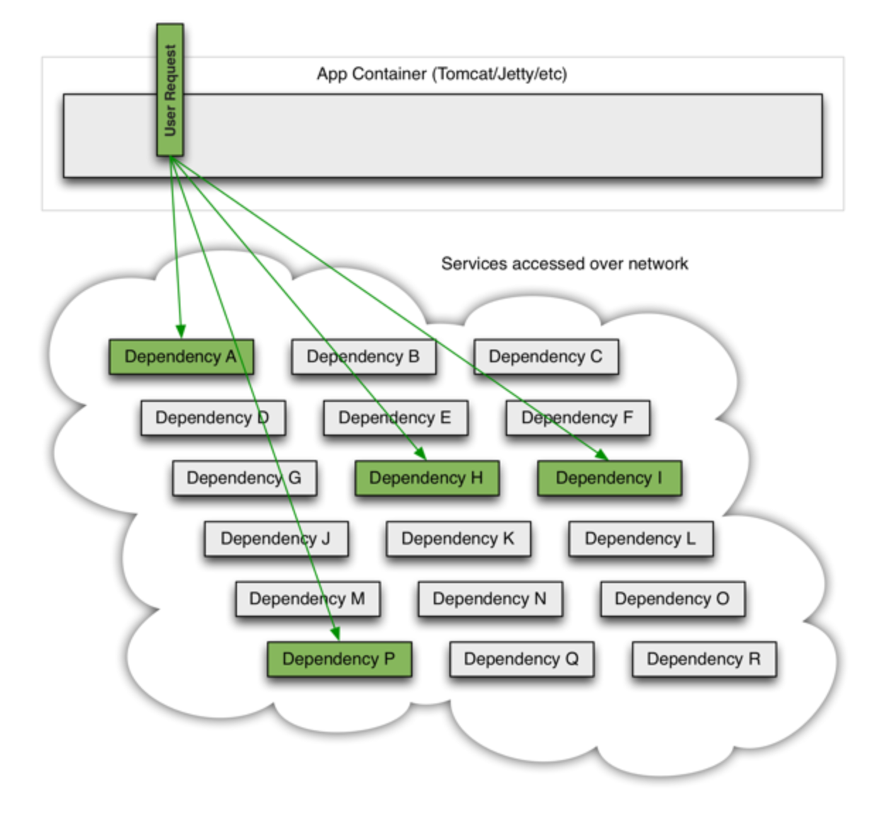
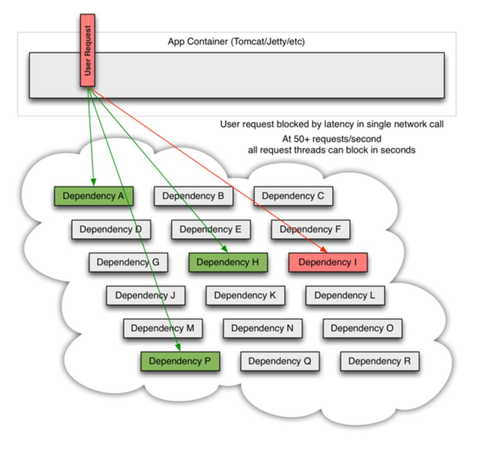
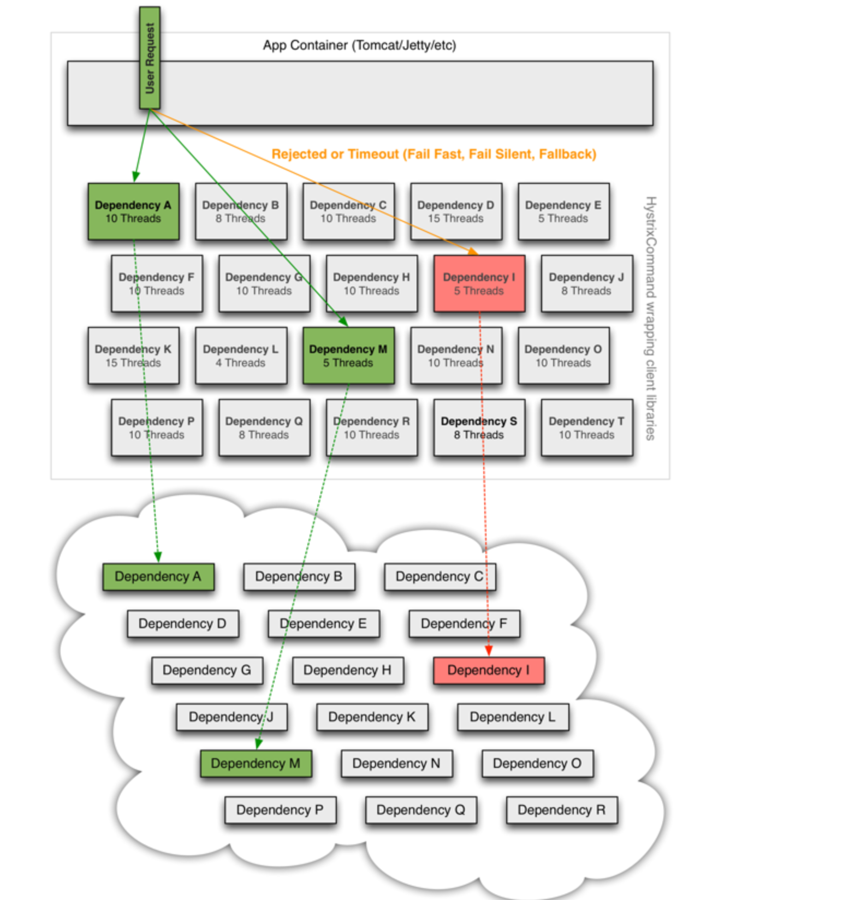

什么是hystrix
==
在一个分布式环境下，不可避免的会出现众多服务依赖项的一部分出现失败。Hystrix 是一个库，它通过增加延迟容忍和、容错逻辑来帮助你控制分布式服务之间的交互。Hystrix实现通过如下的方式来实现它的这个目标：
隔离服务间的访问点，阻止服务间的级联故障，提供回调选项。所有这些方式提升了你系统的整体的弹性。
- hystrix的历史
```
Hystrix 起源于Netflix API 团队2011年开始的弹性工程工作。2012年，hystrix继续演进和成熟，并且在netflix 内部很多团队都接受了它。目前在netflix数百亿的线程隔离，以及数千亿的信号量隔离调用每天都通过hystrix执行。
这使得系统正常运行时间和弹性得到了显著的改善
```
Hystrix 为了什么
==
Hystrix 被设计来做如下的事情：
- 对通过第三方客户端库访问的依赖项的延迟和故障进行保护和控制
- 阻止级联故障发生在复杂的分布式系统中
- 快速失败，快速恢复
- 回退 并且尽可能优雅的降级
- 允许近试试的监控警告以及操作控制

hystrix 解决了什么问题
==
在复杂的分布式架构中应用会有很多的依赖项，每个依赖项都不可避免的会在某些时候出现故障。如果主应用和这些外部故障之间没有隔离，则可能因为这些外部故障而引发自己出现故障
例如，一个应用依赖于30个服务，每个服务有99.99%的正常在线率，如下信息是你可以预期的：
```
$$ 99.99^30=99.7% $$
10亿请求的0.3% = 3000000 失败
2+ 小时的故障时间/月（即使所有的依赖都有不错的正常在线率）
```
不过现实可能比这个更糟糕。即使是依赖项都运行的不错，每个月也有2个多小时的故障时间。
如果一切运行都正常，那么请求流看起来会如下面：


如果众多后端依赖服务有一个出现延迟，他回引起整个用户请求的延迟


在高并发情况下，一个后端依赖延迟能够引起整个服务器的资源在数秒内被占满。
应用中每一个直接或则间接链接网络的点都是潜在的故障来源。比故障更糟糕的是：这些应用可能导致服务间延迟更大，出现级联故障。

- hystrix基于哪些原则构建的呢？
 - 阻止单个依赖用光所所有的容器(比如tomcat)用户线程
 - 减轻复杂，快速失败，而不是进行排队
 - 提供回退，方便用户处理失败的情景
 - 提供隔离技术来限制一个依赖的影响对外扩散
 - 通过近实时的测量监听预警来优化异常发现时间
 - 避免整个依赖客户端执行中出现故障，而不仅仅是网络流量中

Hystrix 是如何实现它的目标的
 ===
 - 将所有对外部系统的调用包装到一个HystrixCommand对象中，它一般会在一个隔离的线程中执行
 - 超时的调用花的时间比你定义的阈值要大。阈值有个默认值，不过大多数依赖服务调用你可以自定义阈值
 - 对每个依赖项维护一个小的线程池（或者信号量）； 如果它满了，所有到这个依赖项的请求到会被立即拒绝而不是进行排队
 - 度量成功、失败、超时、线程拒绝
 - 如果一段时间内，错误的占比达到了阈值，则触发熔断器停止所有对这个服务的请求
 - 在请求失败，拒绝，超时，或短路时执行回退策略
 - 近实时的监控指标和配置变化

 
