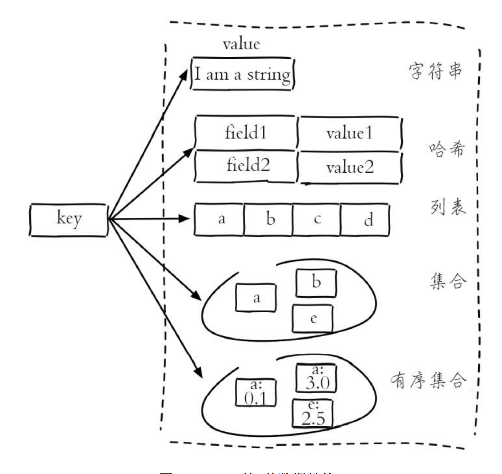
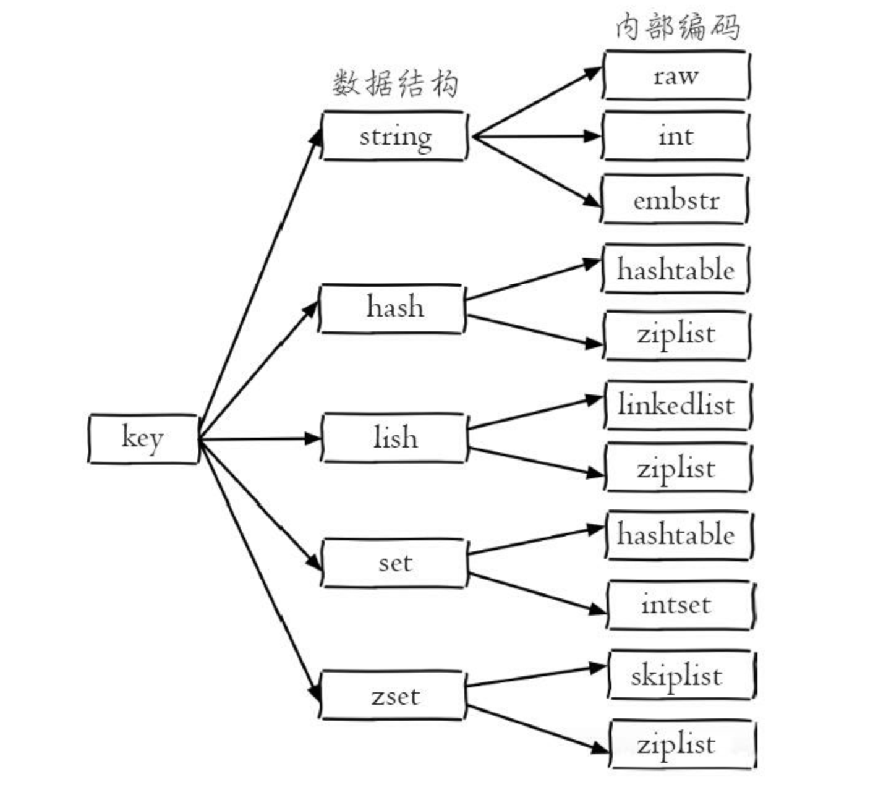
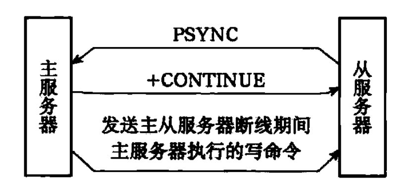
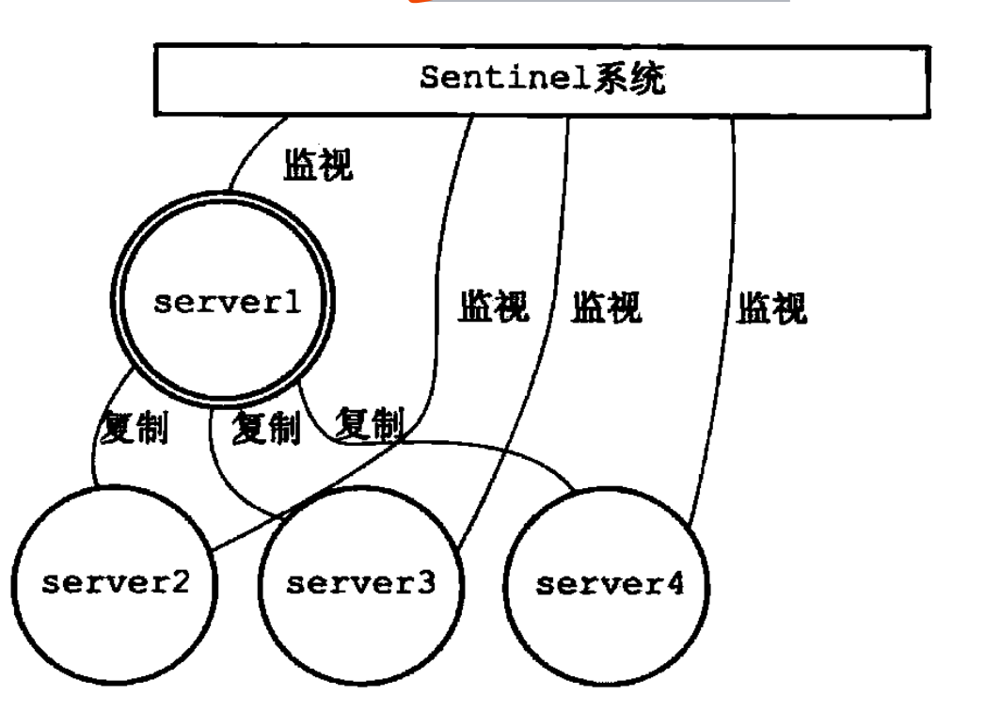

history
===
```
 2008年，redis 的创始人Salvatore Sanfilippo正在其意大利初创公司开发一个实时网络日志分析器；当他想提升其扩展性时，他发现使用传统的关系数据库很难对某些类型的负载进行扩展，因此他开始自己着手开发了一个专用的数据库，也就是redis的前身。在公司项目中使用成功后Salvatore Sanfilippo将项目开源，很快这一项目就在社区流行起来
```

why redis
=========
```
   redis作为一个key-value 内存数据库，在其之前其实已经存在了类似的数据库 memcached.
   那为什么选择redis呢？和memcached相比有什么优势？对两者之间的比较确实是有必要：
   下面的文章是一个不错的比较描述
   ![redis vs memcached]https://medium.com/@Alibaba_Cloud/redis-vs-memcached-in-memory-data-storage-systems-3395279b0941

   大致总结如下
   1、服务端操作：
       redis支持丰富的服务端数据操作，支持的数据类型有string，list，map，set，zset
       而memcached 你操作数据需要数据先提取到客户端，然后处理，最后放到服务端，这样
       的话会增加不少的网络IO。因此如果需要支持缓存处理复杂的数据结构，redis是不错
       的选择
   2、内存使用率：
      对简单的key-value存储，memcached有更高的利用率，但是redis支持哈希结构，如果是
      比较复杂的数据，redis可以压缩复用，这样他的使用率会比redis高
   3、性能比较：
      redis使用单核而memcached使用多核。所以在存小数据时平均每核的性能redis高
      而在存储的数据大于100k时memcached性能更好。
   4、内存管理：
      对于redis和memcached这样基于内存你的数据库，内存管理的效率高低是影响性能的关键因素。纯铜的c语言使用malloc/free函数进行内存你的分配释放。但是这种方法有缺陷：首先，如果malloc和free不匹配的话容易造成内存泄露，其次如果频繁的调用会造成大量的内存碎片无法回收重新利用，降低内存利用率；最后作为系统关掉用，其开销还是挺大的。所以，为了提高内存的管理效率，高效的内存管理方案都不会直接使用malloc/free调用。
      memcached模式使用slab alocation机制管理内存，其主要是想是：按照预先规定的大小，将分配的内存分割成特定长度的快以存储相应长度的key-value数据记录，以完全解决内存碎片问题。Slab Allocation 机制只为存储外部数据而设计，也就是说所有的key-value都存储在Slab Allocation 系统里面。而memcached的其他内存请求则通过普通的malloc/free来申请。因为这些请求的数量和评率决定了他们不会对整个系统的性能造成影响。
      不过虽然memcached可以高效的管理内存而且不会产生内存碎片，但是如果key-value的大小小于chunk，这样就会造成浪费。memecahced主要的cache机制是：LRU算法+超时失效
      redis使用宝座的mallc/free 方法，对每个分配的块记录块的大小，并且有数组记录所有内存的分配情况
   5、集群、分布式存储
      memcached是全内存数据缓存系统，redis虽然支持持久化，但是全内存才是其高性能的本质。作为基于内存的存储系统来说，机器物理内存的狭小是系统能够容纳的最大数据量。如果需要处理的数据量超过了单台机器的物理内存，就需要构建分布式集群来扩扩展存储能力。
      memcached本身不支持分布式，只有通过客户端自己构建分布式存储。相较于memcached，redis可在服务端构建分布式存储。(redis cluster)            
```
[Latency Numbers Every Programmer Should Know](https://people.eecs.berkeley.edu/~rcs/research/interactive_latency.html)
<iframe  src ="http://brenocon.com/dean_perf.html" width="700px" height="500px" frameborder="0" scrolling="no">
</iframe>


redis为什么快速
==
```
为什么一个单线程的服务能够实现快速的处理存储和读取呢？
```
- 完全基于内存：redis绝大部分请求都是纯粹的内存操作，因此非常快
- redis的数据结构简单而且都经过了专门设计的
- 采用单线程，避免了不必要的上线文切换和竞争条件，也就不能存在上线文切换去消耗cpu
- 使用多路复用I/O 复用模型，实现非阻塞IO

为什么才用单线程
==
```
  redis是基于内存的操作，所以cpu很少成为瓶颈，真正的坑你瓶颈是机器内存和网络带宽。而单线程实现起来比多线程容易的多，一次就选择使用了单线程的方案
```
redis支持的数据类型
===
```
  redis 基于sds、双端链表、字典、压缩列表、整数集合等数据结构够构建了一个对象系统，
  这个系统包含：字符串对象、列表对象、哈希对象、集合对象、有序集合对象
  之所以redis 构建自己的数据结构同时同一个数据结构多种实现（对应于多个内部编码）有如下原因：
  1、可以改变内部编码，而对外的数据结构和命令没有变化，相当于对外封装了一致性的接口，内部可以做相应修改
  2、多种内部编码实现可以根据不同场景发挥其自己的优势
```





- String(SDS: 简单动态字符串)
  ```
    redis 没有直接使用c语言传统的字符串标识(以空字符结尾的字符数组)，而是自己构建了
    一种名为简单动态字符串的抽象类型
    sds结构包括：len，free, char buff[]
    使用sds的好处：
    1、常量时间获取字符串长度
    2、杜绝缓冲区溢出，c中今夕strcat等时，如果没有提前计算分配内存你，容易出现内存溢出(char *strcat(char *dest, char *src))、减少修改字符串时的内存分配()
    3、减少修改字符串时的内存分配(sds 修改会进行内存预分配/惰性空间释放)
    4、二进制安全，C以空字符结尾，这样就使得其无法保存图片视频等二进制数据(里面可能包含空字符)
    5、兼容C字符串函数
  ```
- 链表
```
   list 结构：
   typedef struct list {
     listNode *head;
     listNode *tail;
     unsigned int len;
     void *(*dup)(void *ptr);
     void *(*free)(void *ptr);
     void *(*match)(void *ptr);
   }
```
- 字典
- 列表

- 对象：
```
 redis使用对象来表示数据库中的键和值，每次我们新建一个键值对时，我们至少创建了两个对象，一个是键对象，一个是值对象 ，redis中每个对象由redisObject结构标识：
 typedef struct redisObject{
   unsigned type: 4;
   unsigined encoding: 4;
   void *ptr;
 }
```

键失效
===

redis持久化
===
```
   redis可以通过rdb和aof两种方式进行数据持久化
```

- RDB

```
redis是内存数据库，所有数据库状态都保存在内存中，如果服务器进程退出，数据库状态就会消失。为了能够保存数据库状态，redis提供了RDB持久化功能，这个功能可以将内存数据库状态保存到磁盘。
rdb可以手动执行，也可以根据配置定时执行
1、save/bgsave 命令可以生成rdb文件
2、redis启动时会自动载入rdb文件
3、save 、bgrewriteaof命令不能和bgsave命令同时执行
4、通过设置保存条件(save 60 100[60秒内修改了至少100次])可自动执行
```
rdb文件结构：


- AOF

```
除了RDB持久化功能，Redis还提供了AOF(Append Only File)持久化功能. 与RDB方式保存的是键值对不同，AOF保存的是redis的写命令
1、通过服务器的appendfsync选项的值来觉得如何执行aof(always,everysec,no)
2、因为aof会保存所有的写命令，随着时间的流逝，aof文件变得越来越大。如果不控制会对redis服务器宿主计算机造成影响。可以通过aof重写命令
```

redis事件
===
```
redis 基于reactor 模式开发了自己的网络事件处理器（file event handler），
客户端和服务器通过socket 进行通信。
IO多路复用程序负责监听多个套接字，监听到套接字后会向文件事件派发器传送对应的套接字
（先将socket发送到队列，然后发到事件派发器）
更多关于多路复用io的信息请参考
https://notes.shichao.io/unp/ch6/#chapter-6-io-multiplexing-the-select-and-poll-functions
```

redis主从
===
```
 避免服务单点，提高服务的读取性能，可以使用主从的方式实现。主服务器负责写，主从可负责读。redis的复制功能分为2步：
 1、sync： 负责将从服务器的状态更新到主服务器所处的状态
 2、command propagate：负责将主服务器的命令传播到从服务器
```



redis 哨兵
===
```
哨兵模式是redis的高可用性解决方案，由一个或多个sentinel实组成的sentinel系统可以监视多个主服务器以及其下属的从服务器。并在主服务器下线时自动的将从服务器提升为主服务器
```


redis 集群
===

redis 内存占用
redis 超时

注意事项：
==
- set命令执行后会把key关联的超时信息删除掉，如果有需要得重新设置超时
-


使用实践
==
- 缓存考量的点
  - 收益成本
  ```
  加速读写
  降低后端负载
  数据可能不一致，增加了代码复杂度，维护成本增高
  ```
  - 更新策略
  ```
   1、LRU/FIFO等算法剔除
   2、超时剔除
   3、主动更新
  ```
  - 粒度（全部列保存还是保存部分列）
  - 穿透（大量命中率低直接抵达DB查询）
  ```
   解决方案：
   1、缓存空对象，对应cache中没有命中的key，如果db中也没有就更新一份空值的数据到cache
   2、布朗过滤器拦截，在cache之上加一个filter（保存所有存在的key），如果通过filter知道key不存在则不需要去访问db
  ```
  - 无底洞（增减缓存节点性能不但没有变好反而变差）
  ```
    原因：在分布式情况下一key都通过hash分不到不同的节点中，如果是一些批量的操作，因数据的分散可能会导致获取结果需要访问多次网络，需要保持的网络连接相应的增加。
    分布式下批量操作的优化：（批量的耗时=网络耗时+命令执行耗时）
    在分析耗时时可一发现，想优化只能通过网络耗时去找突破口，比较好的方式可能是：
    1、客户端更加jedisCluster的特性，将key进行crc16处理得到对应的slot，根据slot分组访问相应的jedis
    2、并行或串行向指定的节点发送请求
  ```
  - 雪崩
  ```
    雪崩指的是缓存崩溃无法使用时相关的请求直接抵达db，对于这个主要是两种方式：
    1、保证缓存服务的高可用 sentinel、cluster
    2、依赖于隔离组件可以将缓存服务隔离、降级
  ```
  - 热点key优化
  ```
  作为缓存，我们大部分时候会对热点数据定时更新，或则启动的时候将数据加载到缓存。不过这中间会有些问题：
  1、当前key是热点数据并发量非常大
  2、重建缓存不能再短时间内完成
  这样在缓存失效的瞬间可能大量的线程请求到后端导致后端复杂突然激增，极端情况可能就会造成后端崩溃
  对此从如下的方式去考虑解决：
  1、互斥锁：只允许一个线程进行缓存的重建（某个线程到后端db查到数据后进行缓存重建）
  2、key不设置过期，这样就不会有需要重建缓存的过程了（不过有数据不一致的情况，需要考虑容忍度，什么时候进行逻辑上的key失效重新加载）
  ```
